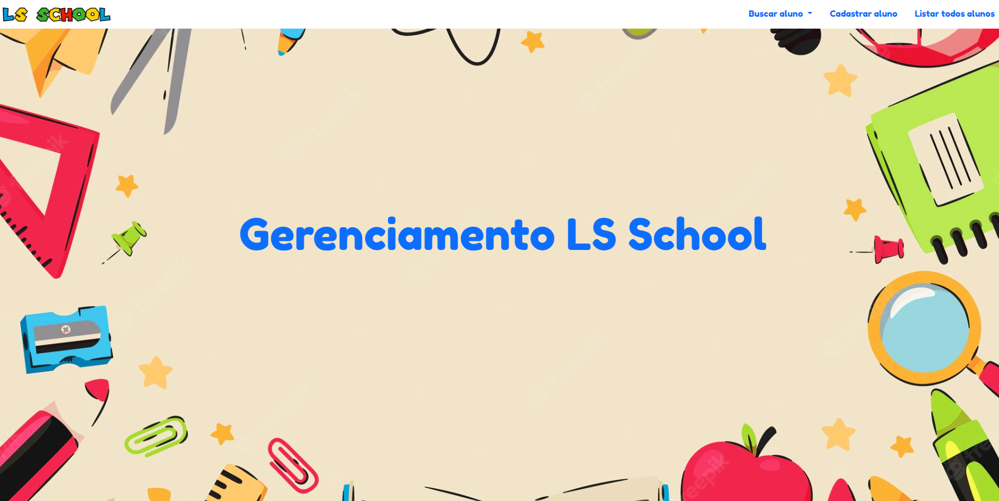
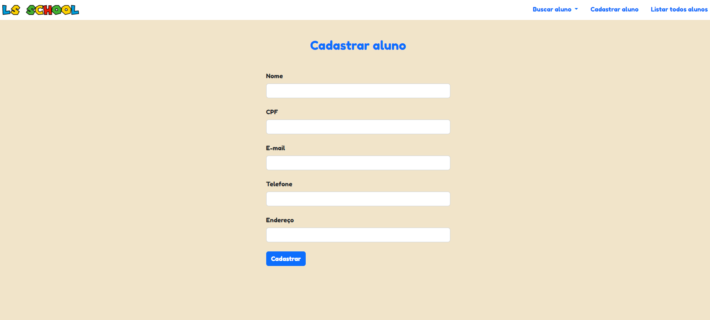
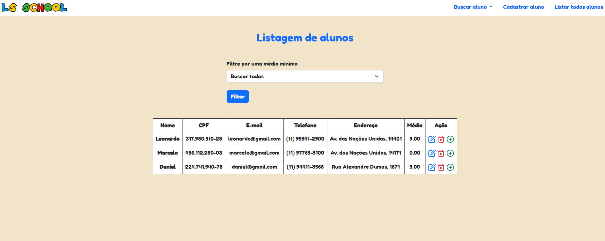
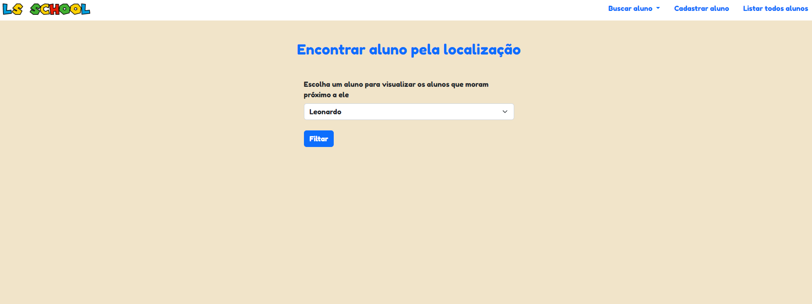

<h1 align="center">
    
</h1>

<h2>Página principal</h2>
<h1 align="center">
    
</h1>

<h2>Página de cadastro de alunos</h2>
<h1 align="center">
    
</h1>

<h2>Página de listagem de alunos</h2>
<h1 align="center">
    
</h1>

<h2>Página de busca por geolocalização</h2>
<h1 align="center">
    
</h1>

<h2>Resultado da busca por geolocalização</h2>
<h1 align="center">
    
</h1>

# Índice

- [Sobre](#-sobre)
- [Tecnologias utilizadas](#-tecnologias-utilizadas)

## 🔖 Sobre

Sistema desenvolvido para uma escola conseguir gerenciar seus alunos.

---

## 💻 Tecnologias utilizadas

O projeto foi desenvolvido utilizando as seguintes tecnologias:

- [Java](https://dev.java)
- [Spring Framework](https://spring.io)
- [Spring MVC](https://spring.io/guides/gs/serving-web-content/)
- [Thymeleaf](https://www.thymeleaf.org)

---

<h3 align="center">
  Feito com ❤️ por Leonardo Santana
</h3>
